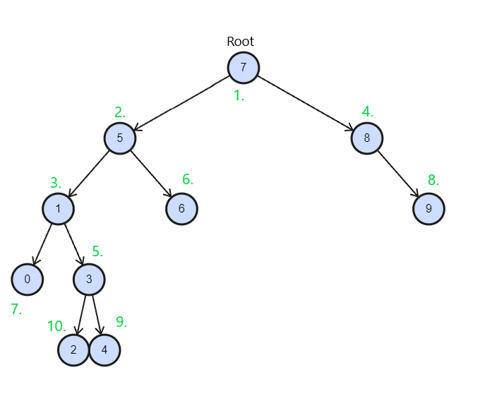

# Proje 3

[7, 5, 1, 8, 3, 6, 0, 9, 4, 2] dizisinin Binary-Search-Tree aşamalarını yazınız.

Örnek: root x'dir. root'un sağından y bulunur. Solunda z bulunur vb.

1. 7 değerini kök kabul edelim.
2. 5 değeri 7'den küçük olduğu için sol tarafa geçer.
3. 1 değeri 7'den küçük, 5'ten de küçük olduğu için 5'in sol tarafına geçer.
4. 8 değeri 7'den büyük olduğu için 7'nin sağ tarafına geçer.
5. 3 değeri 7'den küçük, 5'ten küçük 1'den büyük olduğu için 1'in sağ tarafına geçer.
6. 6 değeri 7'den küçük, 5'ten büyük olduğu için 5'in sağına geçer.
7. 0 değeri 7,5 ve 1 den küçük olduğu için 1'in soluna geçer.
8. 9 değeri 7'den büyük, 8'den büyük olduğu için 8'in sağına geçer.
9. 4 değeri 7 ve 5'ten küçük, 1 ve 3'ten büyük olduğu için 3'ün sağına geçer.
10. 2 değeri 7 ve 5'ten küçük, 1'den büyük, 3'ten küçük olduğu için 3'ün solunda yer alır.

